<picture>
  <source media="(prefers-color-scheme: dark)" srcset="./assets/header-dark.svg">
  <source media="(prefers-color-scheme: light)" srcset="./assets/header-light.svg">
  
</picture>

  
  
  

## About

I'm Justins, an M.Sc. Data Science student at FAU Erlangen-Nürnberg, majoring in Machine Learning & AI.
I work on quantum computing, quantum machine learning and optimisation, alongside classical machine learning.

- **Background:** B.Sc. in Mathematics, Physics and Statistics (Mahatma Gandhi University, India).
- **Experience:** research assistant at the ML & Data Analytics Lab, FAU (2024); business analyst before my master's.
- **Now:** brain-tumour classification with a quantum SVM, compared against a classical baseline.

<picture>
  <source media="(prefers-color-scheme: dark)" srcset="./assets/divider-dark.svg">
  <source media="(prefers-color-scheme: light)" srcset="./assets/divider-light.svg">
  
</picture>

## Quantum work

| Event | What I did | Code |
| :-- | :-- | :-: |
| **ETH Zürich Quantum Hackathon 2026** | Benchmarked photonic quantum PINNs for Quandela's challenge | [repo](https://github.com/justinspv24/ETH-zurich-quantum-hackathon-2026) |
| **MIT iQuHACK 2026** · NVIDIA challenge | Seeded a classical memetic tabu search with quantum samples for the LABS problem | |
| **Quantum Ideas Factory 2026** | Studied how much entanglement random permutation circuits create, up to 20 qubits | |
| **IQM Quantum School** | Quantum algorithms and benchmarks on IBM Quantum and IQM hardware | [repo](https://github.com/justinspv24/IQM_Quantum_School) |
| **Qiskit Global Summer School** 2025, 2026 | Quantum Excellence badge both years | |
| **Bad Honnef Physics School** 2026 | Quantum machine learning, ZX calculus, tensor networks, error correction | |

## Selected projects

| Project | Method | Grade | Code |
| :-- | :-- | :-: | :-: |
| **ATLAS** — cell-tower placement across Germany | Two-phase MILP that picks tower sites and radii | 1.0 | |
| **Real-time multi-face emotion recognition** | YOLOv5 + custom CNN | 1.0 | [repo](https://github.com/justinspv24/Real_time_Multi_facial_emotion_recognition) |
| **Tantrix puzzle optimisation** | Mixed-integer linear programming | 1.3 | [repo](https://github.com/justinspv24/Tantrix_modeling) |
| **Tool condition monitoring** | ML on vibration data to detect cutting-tool wear | — | [repo](https://github.com/justinspv24/Tool-Condition-Monitoring) |
| **Breast cancer detection on mammograms** | Deep learning with multi-scale patches | — | [repo](https://github.com/justinspv24/DL-to-detect-breast-cancer-from-mammography) |
| **Hack-A-Bot 2026** · Siemens Healthineers | Hackathon project, 3rd place | — | [repo](https://github.com/justinspv24/Hack-A-Bot-2026) |
| **Sentiment analysis** | LSTM | 2.0 | [repo](https://github.com/justinspv24/Sentiment-Analysis-LSTM) |

<picture>
  <source media="(prefers-color-scheme: dark)" srcset="./assets/divider-dark.svg">
  <source media="(prefers-color-scheme: light)" srcset="./assets/divider-light.svg">
  
</picture>

## Tools

**Quantum**&nbsp;     

**Machine learning**&nbsp;     

**Data & tools**&nbsp;     

<picture>
  <source media="(prefers-color-scheme: dark)" srcset="./assets/divider-dark.svg">
  <source media="(prefers-color-scheme: light)" srcset="./assets/divider-light.svg">
  
</picture>

Open to work in quantum computing, ML and data science · Erlangen, Germany

